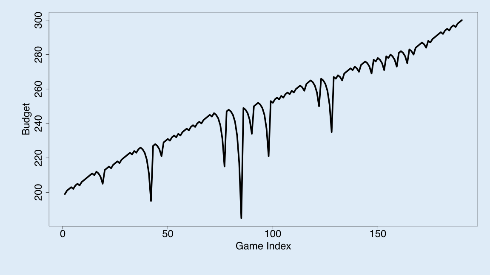
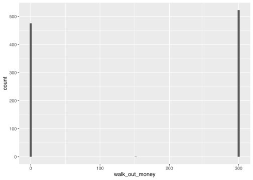
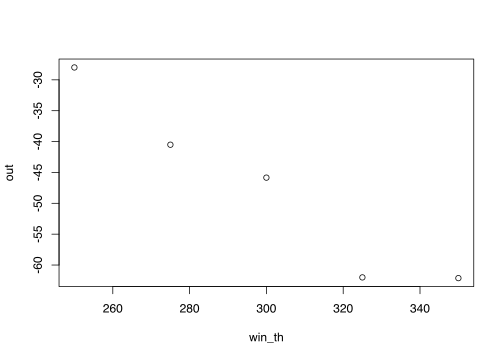
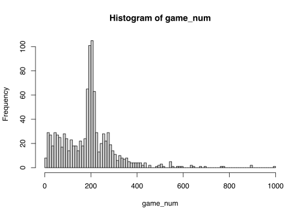

writeup
================

# 01-roulette

### Zhuoyi Zhan

### September 06, 2021

## Introduction

In this question I want to answer the question to decide if Martingale
strategy is always profitable. The purpose is to use programming to
simulate real-life roulette, calculate average earning of the Martingale
betting strategy and see if different input parameters would impact the
average earnings.

## 1.1 Backgound

Roulette is a popular gambling game. Starting at $1, if player guess
right, he/she will get her money back and win double the bet. The
Martingale is a common betting strategy that seems to guarantee return.
When player lose,he/she doubles the amount of bet; if win, restart with
1. When stopping rule is met, player stops. We set starting budget,
winning threshold, maximum wager, and maximum game to calculate average
earning by repeating the simulations.

|     Parameter     | value |
|:-----------------:|:-----:|
|  starting budget  | $200  |
| winning threshold | $300  |
|   maximum wager   | $100  |
|   maximum game    | 1000  |

## 2 Methods

In this simulation, functions help to accomplish tasks like spinning
wheels, recording outcomes and calculating budget.

``` r
library(dplyr)
```

    ## 
    ## Attaching package: 'dplyr'

    ## The following objects are masked from 'package:stats':
    ## 
    ##     filter, lag

    ## The following objects are masked from 'package:base':
    ## 
    ##     intersect, setdiff, setequal, union

``` r
library(tidyverse)
```

    ## ── Attaching packages ─────────────────────────────────────── tidyverse 1.3.1 ──

    ## ✓ ggplot2 3.3.5     ✓ purrr   0.3.4
    ## ✓ tibble  3.1.4     ✓ stringr 1.4.0
    ## ✓ tidyr   1.1.3     ✓ forcats 0.5.1
    ## ✓ readr   2.0.1

    ## ── Conflicts ────────────────────────────────────────── tidyverse_conflicts() ──
    ## x dplyr::filter() masks stats::filter()
    ## x dplyr::lag()    masks stats::lag()

``` r
 function(x) x[length(x)] 
```

    ## function(x) x[length(x)]

``` r
#This step we are trying to  simulate spinning the roulette. sample() is a function can take a random sample from the data object. In this case, yield a result from 18 red, 18 black, and 2 green
single_spin <- function(){
  possible_outcomes <- c(rep("red",18), rep("black",18), rep("green",2))
  sample(possible_outcomes, 1)
}

#This step is trying to simulate the betting strategy. It receives input of previous wager, last spinning result, maximum wager that casino set and how much much palyer left with. If last spin player get red, then keep bet $1 on red, else, 2 times the previous wager but it should not exceed player's current budget or maximum wager allowed.

martingale_wager <- function(
  previous_wager
  , previous_outcome
  , max_wager
  , current_budget
){
  if(previous_outcome == "red") return(1)
  min(2*previous_wager, max_wager, current_budget)
}

one_play <- function(previous_ledger_entry, max_wager){
  # Create a copy of the input object that will become the output object
  out <- previous_ledger_entry
  out[1, "game_index"] <- previous_ledger_entry[1, "game_index"] + 1
  #game index is increasing with the number of game played. 
  out[1, "starting_budget"] <- previous_ledger_entry[1, "ending_budget"]
  #Each game, player have budget of what they left from last game.
  out[1, "wager"] <- martingale_wager(
    previous_wager = previous_ledger_entry[1, "wager"]
    , previous_outcome = previous_ledger_entry[1, "outcome"]
    , max_wager = max_wager
    , current_budget = out[1, "starting_budget"]
  )
  #To get and record this time's wager in, it call martingale_wager() function with last time's wager, outcomes,max wager and this time's starting budget.
  out[1, "outcome"] <- single_spin()
  # Calling the single_spin() function to get an outcome and record.
  out[1, "ending_budget"] <- out[1, "starting_budget"] + 
    ifelse(out[1, "outcome"] == "red", +1, -1)*out[1, "wager"]
  return(out)
  #the new ending budget will be starting budget plus wager if outcome is red, or minus wager is not red.
}

one_series <- function(
  max_games, starting_budget, winning_threshold, max_wager
){
  # Initialize ledger
  ledger <- data.frame(
      game_index = 0:max_games
    , starting_budget = NA_integer_
    , wager = NA_integer_
    , outcome = NA_character_
    , ending_budget = NA_integer_
  )#this defines the variable types.
  ledger[1, "wager"] <- 1
  ledger[1, "outcome"] <- "red"
  ledger[1, "ending_budget"] <- starting_budget
  # the wager starts with 1.
  for(i in 2:nrow(ledger)){
    #browser()
    ledger[i,] <- one_play(ledger[i-1,], max_wager)
    # i is this time, i-1 refer to the last game. By calling one_play() with last game, this step keeps recording every game played.
    if(stopping_rule(ledger[i,], winning_threshold)) break
  } #this will check if the plyyer reaches stopping rules. If yes then stop.
  # Return non-empty portion of ledger
  ledger[2:i, ]
}

stopping_rule <- function(
  ledger_entry
  , winning_threshold
){
  ending_budget <- ledger_entry[1, "ending_budget"]
  if(ending_budget <= 0) return(TRUE)
  if(ending_budget >= winning_threshold) return(TRUE)
  FALSE
}# The rule to stop are when running out of money or now having money that is equal or more than winning threshold. 

profit <- function(ledger){
  n <- nrow(ledger)
  profit <- ledger[n, "ending_budget"] - ledger[1, "starting_budget"]
  return(profit)
} # The profit equals to last game's budget minus budget at first.

require(magrittr)
```

    ## Loading required package: magrittr

    ## 
    ## Attaching package: 'magrittr'

    ## The following object is masked from 'package:purrr':
    ## 
    ##     set_names

    ## The following object is masked from 'package:tidyr':
    ## 
    ##     extract

``` r
# It creates figures of winning and losing with starting budget of $200, winning threshold of $300, maximum 1000 plays and maximum wager of $100
svg(filename = "loser.svg", width=16, height =9)
par(cex.axis=2, cex.lab = 2, mar = c(8,8,2,2), bg = rgb(222, 235, 247, max = 255))
set.seed(1)
ledger <- one_series(1000,200,300,100)
plot(ledger[,c(1,5)], type = "l", lwd = 5, xlab = "Game Index", ylab = "Budget")
dev.off()
```

    ## svg 
    ##   2

``` r
svg(filename = "winner.svg", width=16, height =9)
par(cex.axis=2, cex.lab = 2, mar = c(8,8,2,2), bg = rgb(222, 235, 247, max = 255))
set.seed(2)
l2 <- one_series(1000,200,300,100)
plot(l2[,c(1,5)], type = "l", lwd = 5, xlab = "Game Index", ylab = "Budget")
dev.off()
```

    ## svg 
    ##   2

## 3 Results

1

<figure>
<figcaption aria-hidden="true">Possible Outcomes: Figure of wining</figcaption>
</figure>

2


We can see that one can either lose or win with Martingale strategy.
Martingale is not 100% profitable.

### Simulation for 1000 times:

This code creates a list to store each round’s ending budget and compare
with the starting budget $200 to get the earning. There are 1000 rounds
and we calculate the average earning by get the means of all earning.

``` r
# Simulation
walk_out_money <- rep(NA, 1000)
for(j in seq_along(walk_out_money)){
  data = one_series(1000, 200, 300, 100)
  walk_out_money[j] <- (data$ending_budget)[length(data$ending_budget)]
}

# Walk out money distribution
#hist(walk_out_money, breaks = 100)
wom <- data_frame(walk_out_money)
```

    ## Warning: `data_frame()` was deprecated in tibble 1.1.0.
    ## Please use `tibble()` instead.

``` r
#View(wom)
```

``` r
# Walk out money distribution
#hist(walk_out_money, breaks = 100)
wom <- data_frame(walk_out_money)
#View(wom)
g1 <- ggplot(wom,aes(x=walk_out_money))+ geom_histogram(bins=100)
g1
```

<!-- --> During 1000
games, The Roulette player either win $300 or lose all money. The player
lose nearly half the times.

``` r
# Estimated probability of walking out with extra cash
mean(walk_out_money > 200)
```

    ## [1] 0.523

``` r
# Estimated earnings
mean(walk_out_money - 200)
```

    ## [1] -42.948

The probability that player would win $300 is 51.37% and the average
earnining for Roulette is -45.8854. So Martingale Startegy is not
profitable and resulting in an average loss.

### Change the winning threshold

``` r
# Simulation
out <- rep(NA, 5)
win_th <- c(250, 275, 300, 325, 350)
for (i in (1:5)){
  walk_out_money <- rep(NA, 100)
  for(j in seq_along(walk_out_money)){
    data = one_series(1000, 200, win_th[i], 100)
  walk_out_money[j] <- (data$ending_budget)[length(data$ending_budget)]
  }
  out[i] <- mean(walk_out_money - 200)
}

# Walk out money distribution
#hist(walk_out_money, breaks = 100)
```

``` r
plot(win_th, out)
```

<!-- -->

From the above figures, we can see the impact of changing winning
threshold from 250 to 350. A lower threshold results in higher walk out
money and higher threshold results in a lower walk out budget. So
winning threshold has an impact on average earning.

### Average Numbers of Plays

This code creates a list to store how many games are played in each
round and there are 1000 rounds and we calculate the average number of
play by get the means of all rounds.

``` r
game_num <- rep(NA, 1000)
for(j in seq_along(game_num)){
  data = one_series(1000, 200, 300, 100)
  game_num[j] <- (data$game_index)[length(data$game_index)]
}

hist(game_num, breaks = 100)
```

<!-- -->

``` r
mean(game_num)
```

    ## [1] 198.955

This is the distribution of the average played game. The average number
of plays is 206.884.

### Limitation & Simplication

This simulation is done by computer and does not 100% replicate
real-life gambling. People do not follow the stopping rules. For
example, people will not stop at winning threshold for they believe in
luck. Or casino will not set $100 has maximum wager. These are the
uncertain factor of the simulation.

## 4 Conclusions

By changing the input parameter and repeatedly simulate, we find that
Martingale betting strategy does not guarantee earnings. A player can
reach winning threshold or lose all money. The average earning is
negative in this 1000 simulation. So this strategy is not always
profitable. And changing winning threshold shows a higher threshold
results in a lower walk out budget.
